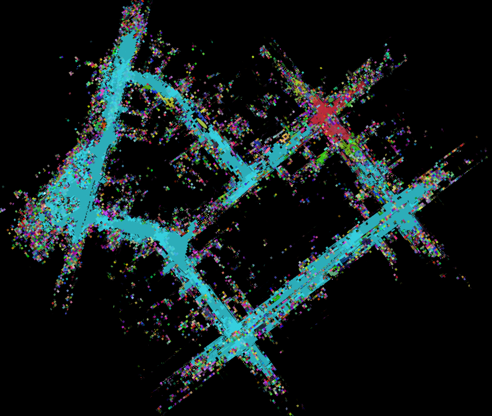
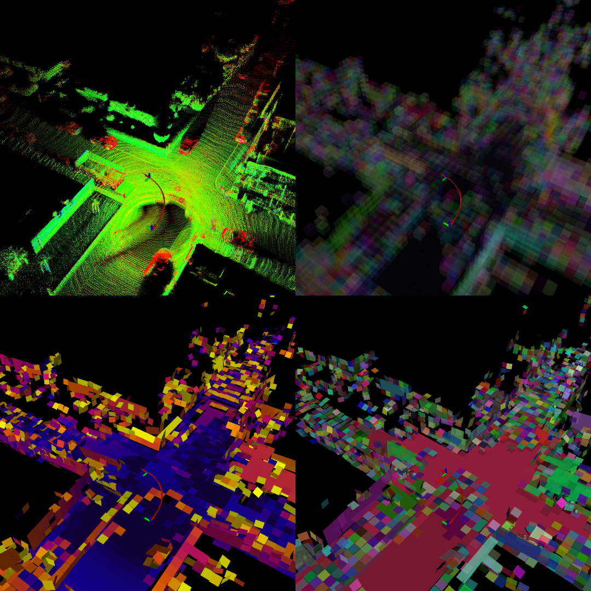

# GILDA-LIO: Gaussian-based Inertial-LiDAR Dynamic Adaptation

A high-performance Gaussian-based LiDAR-Inertial Odometry (LIO) system featuring real-time Gaussian likelihood estimation and adaptive mapping. GILDA leverages Gaussian voxel representation for efficient and accurate 3D mapping with LiDAR-Inertial fusion using the Iterative Error-State Extended Kalman Filter (iESEKF) from `LieOdyssey`.


<div align="center">
  
  <small>
  <p> KITTI 0027 Voxel Map </p>
  </small>
</div>
<div align="center">
  
  <small>
  <p> Top left: accumulated pointcloud. Top right: map voxels. Bottom left: plane uncertainty (blue low, yellow high). Bottom right: Fused voxels with same color </p>
  </small>
</div>

## Features

- **Gaussian Likelihood Estimation**: Real-time Gaussian-based point-to-plane residual computation
- **Adaptive Gaussian Voxel Mapping (IVox)**: Efficient incremental voxel representation with Gaussian statistics
- **LiDAR-Inertial Fusion**: Combines LiDAR point clouds with IMU data for robust odometry
- **iESEKF on Lie Groups**: State estimation on SGal(3) with proper uncertainty handling
- **Multi-Sensor Support**: Compatible with multiple LiDAR types:
  - Ouster
  - Velodyne
  - Hesai
  - Livox
- **Motion Compensation**: Real-time LiDAR deskewing based on IMU motion
- **Dynamic Voxel Adaptation**: Voxel merging strategy based on geometry and measurement confidence
- **ROS 2 Integration**: Full ROS 2 middleware support with frame broadcasting and visualization

## Prerequisites

### System Requirements
- Ubuntu 20.04 or later
- ROS 2 Humble or later
- C++17 compatible compiler
- Multi-core processor recommended (for OpenMP)

### Dependencies
- **lie_odyssey**: Lie group-based state-space estimation framework
- **PCL** (Point Cloud Library) >= 1.12
- **Eigen3**: Linear algebra library
- **OpenMP**: For multi-threaded processing

### ROS 2 Dependencies
- `rclcpp`: ROS C++ client library
- `sensor_msgs`: Sensor message types
- `geometry_msgs`: Geometry message types
- `visualization_msgs`: Visualization message types
- `nav_msgs`: Navigation message types
- `tf2` and `tf2_ros`: Transform library and ROS integration
- `pcl_conversions`: PCL and ROS message conversions

## Installation

### From Source

1. **Clone the repository** into your ROS 2 workspace:
   ```bash
   cd ~/colcon_ws/src
   # LieOdyssey should already be cloned
   ```

2. **Install dependencies**:
   ```bash
   rosdep install --from-paths src --ignore-src -r -y
   ```

3. **Build the workspace**:
   ```bash
   cd ~/colcon_ws
   colcon build --packages-select gilda_lio
   ```

4. **Source the setup script**:
   ```bash
   source install/setup.bash
   ```

## Usage

### Launch the Node

Run the GILDA-LIO odometry node:

```bash
ros2 launch gilda_lio gilda_lio.launch.py
```

#### Launch Arguments

- `config`: Path to YAML configuration file (default: `config/params.yaml`)
- `rviz`: Enable RViz visualization (default: `False`)

Example with RViz:
```bash
ros2 launch gilda_lio gilda_lio.launch.py rviz:=True
```

Example with KITTI dataset configuration:
```bash
ros2 launch gilda_lio gilda_lio.launch.py config:=$(ros2 pkg prefix gilda_lio)/share/gilda_lio/config/kitti.yaml rviz:=True
```

Example with custom config:
```bash
ros2 launch gilda_lio gilda_lio.launch.py config:=/path/to/custom_config.yaml
```

## Configuration

### Configuration File Structure

GILDA uses YAML configuration files located in the `config/` directory. Key parameters:

```yaml
gilda_lio_node:
  ros__parameters:
    # Topic subscriptions
    topics:
      input:
        lidar: /ouster/points        # LiDAR point cloud topic
        imu: /ouster/imu              # IMU measurements topic

    # Output frames and transforms
    frames:
      world: map                      # World/global frame name
      body: base_link                 # Robot body frame name
      tf_pub: true                    # Publish TF transforms

    # Processing parameters
    num_threads: 1                    # OpenMP threads for parallel processing
    sensor_type: "OUSTER"             # LiDAR sensor type
    debug: true                       # Enable debug point clouds
    time_offset: true                 # Estimate sync offset between IMU and LiDAR
    end_of_sweep: false               # Sweep reference time (start vs end)
    motion_compensation: true         # Enable LiDAR deskewing

    # IMU calibration (note: disabled by default for GILDA)
    calibration:
      gravity_align: false            # Estimate gravity vector
      accel: false                    # Estimate accelerometer bias
      gyro: false                     # Estimate gyroscope bias
      time: 3.0                       # [s] Calibration duration
```

### Pre-configured Datasets

Three example configurations are provided:

- **`config/kitti.yaml`**: Optimized for the KITTI dataset with Velodyne LiDAR
- **`config/ona.yaml`**: Optimized for the ONA dataset
- **`config/params.yaml`**: General purpose configuration for Ouster LiDAR

### Configuration Recommendations

| Scenario | Key Settings |
|----------|--------------|
| **Moving Robot** | `motion_compensation: true`, `time_offset: true` |
| **Pre-calibrated IMU** | `calibration: {gravity_align: false, accel: false, gyro: false}` |
| **High-speed Motion** | `num_threads: 4+`, `sensor_type: "OUSTER"` |
| **Indoor Mapping** | `debug: true`, `rviz: true` for visualization |

## Node Interface

### Subscribed Topics

| Topic | Type | Description |
|-------|------|-------------|
| `/ouster/points` | `sensor_msgs/PointCloud2` | LiDAR point cloud (configurable) |
| `/ouster/imu` | `sensor_msgs/Imu` | IMU measurements (configurable) |

### Published Topics

| Topic | Type | Description |
|-------|------|-------------|
| `tf` | `tf2_msgs/TFMessage` | Transform frames (world → body) |
| `/gilda_lio_node/odometry` | `nav_msgs/Odometry` | Estimated odometry |

### Frames

| Frame | Description |
|-------|-------------|
| `map` | Global/world frame (configurable) |
| `base_link` | Robot body frame (configurable) |

## Core Components

### OdometryCore
Central processing engine that:
- Initializes the SLAM system with Gaussian map backend
- Processes and queues IMU measurements
- Manages LiDAR scan processing and synchronization
- Computes point-to-plane residuals
- Maintains system state and covariance

### Gaussian IVox Map
High-performance adaptive voxel-based mapping with:
- **Incremental Voxel Structure**: Efficient spatial hashing for point management
- **Gaussian Statistics**: Per-voxel mean and covariance tracking
- **Adaptive Map**: Dynamic voxel merging based on measurement uncertainty and pointcloud geometry

**Key Data Structure**: Hash-based voxel grid with Gaussian statistics per voxel
- Voxel coordinates: Integer 3D vectors
- Statistics: Position, covariance matrix, point count
- Adjugate matrix computation for efficient likelihood calculation
- Precise plane covariance estimation with sensor modeling

### EKF (iESEKF)
- Operates on Lie group SGal(3) for robust odometry representation
- Propagates state using kinematic model from IMU
- Updates state using Gaussian-weighted point-to-plane measurements
- Efficiently handles 6D pose uncertainty and 6D velocity uncertainty
- Adaptive measurement weighting based on Gaussian likelihood

### State
- Represents: pose, velocity, sensor biases and gravity
- Maintains: Full covariance matrices
- Handles: Extrinsic calibration between LiDAR and IMU
- Provides: Covariance extraction for uncertainty quantification

## Algorithm Overview

1. **IMU Buffering**: Queue and synchronize IMU measurements with LiDAR scans
2. **Deskewing**: Compensate for robot motion during scan using interpolated IMU
3. **Voxel Lookup**: Query Gaussian voxel map for measurement associations
4. **Gaussian Likelihood**: Compute point-to-plane residuals with Gaussian weights
5. **EKF Prediction**: Update state prediction with incoming IMU data
6. **EKF Update**: Correct pose and velocity using Gaussian-weighted measurements
7. **Map Update**: Insert registered scan points into adaptive Gaussian voxel map
8. **Dynamic Adaptation**: Merge plane/volume features

## Tips and Troubleshooting

### Gaussian Map Tuning
- The map automatically merges voxels based on mahalanobis distance between gaussians.
- Models PLANE features explicitly (plane equation parametrization) because of its importance (and availability) in registration
- You should tune the voxel resolution w.r.t. the environment where the robot navigates. 

### Performance Optimization
- Increase `num_threads` for better parallelism on multi-core systems
- Set `debug: false` in production to reduce overhead

### IMU Synchronization
- Keep the robot **stationary** for the duration specified in `calibration.time` (default: 3 seconds) during startup
- The calibration phase estimates gravity alignment and sensor biases
- Disable specific calibration components if your IMU is pre-calibrated

### Sensor Configuration
- Verify `sensor_type` matches your hardware
- Adjust `end_of_sweep` based on LiDAR timestamp reference
- For custom sensors, check timestamp format compatibility

### Visualize in RViz:
- Current odometry trajectory
- Raw and deskewed point clouds
- Adaptive Gaussian voxel map
- Estimated covariance ellipsoids

## Performance Characteristics

- **Update Rate**: Real-time processing at LiDAR frequency (10-20 Hz typical)
- **Latency**: < 50 ms from scan acquisition to pose update
- **Memory**: Adaptive based on map complexity
- **CPU**: Scales with `num_threads` and point cloud density

## License

See LICENSE file in the parent LieOdyssey repository.

## Maintainer

- **Author**: fetty
- **Email**: fetty3113@gmail.com

## References
- [Voxelmap++](https://github.com/uestc-icsp/VoxelMapPlus_Public): Mergeable Voxel Mapping Method for Online LiDAR(-inertial) Odometry